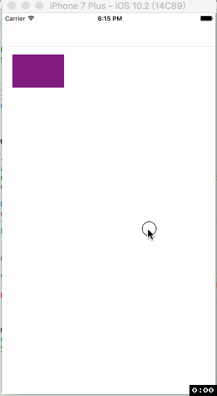

# ASHReactNative
ReactNative-iOS 使用

这套使用方法已经运用到线上，稳定运行很久了。
###1.加载网络zip形式
```
[[ASHReactNative shareInstance] pushRNViewControllerWithURL:@"http://static.seeyouyima.com/rn.meiyou.com/meiyou-rn.zip?model=tips"];
```
###其中，model是页面名称，一个bundle可以对应多个页面。

###2.加载本地包
```
[[ASHReactNative shareInstance] pushRNViewControllerWithBundleName:@"main.jsbundle" modelName:@"index"];
```

如有疑问:可以加qq询问 736139669.


 
